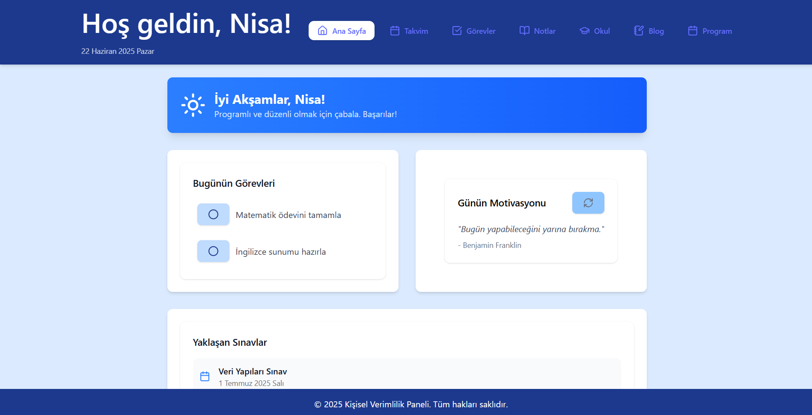
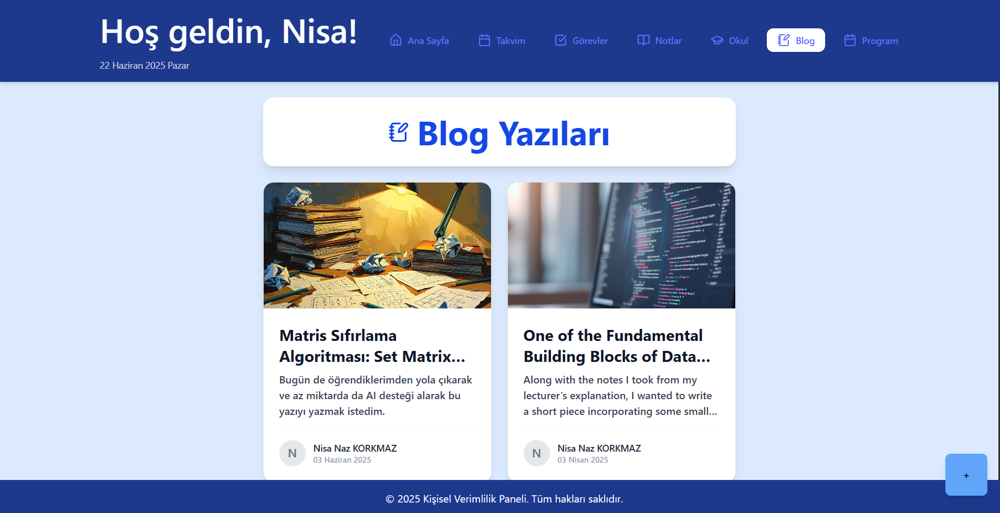

# Personal Productivity Dashboard

This project is a web-based productivity dashboard built with React, TypeScript, Tailwind CSS, and Vite.  
It was developed as part of my **"Graphical User Interface Design"** course.

## Features

- **Home:** Welcome page with quick navigation.
- **Calendar:** Interactive calendar for event tracking.
- **Tasks:** To-do list for personal or academic goals.
- **Notes:** Lightweight note-taking section.
- **School:** Course schedule and class-related content.
- **Blog:** A space for personal blog posts and writing practice.

## Tech Stack

- **React** (with TypeScript)
- **Vite** for build and dev server
- **Tailwind CSS** for utility-first styling
- **React Router** for page navigation
- **Lucide React** for modern icons

## Preview

  


## Installation

```bash
git clone https://github.com/your-username/Personal-Productivity-Dashboard.git
cd personal-dashboard
npm install
npm run dev
```
